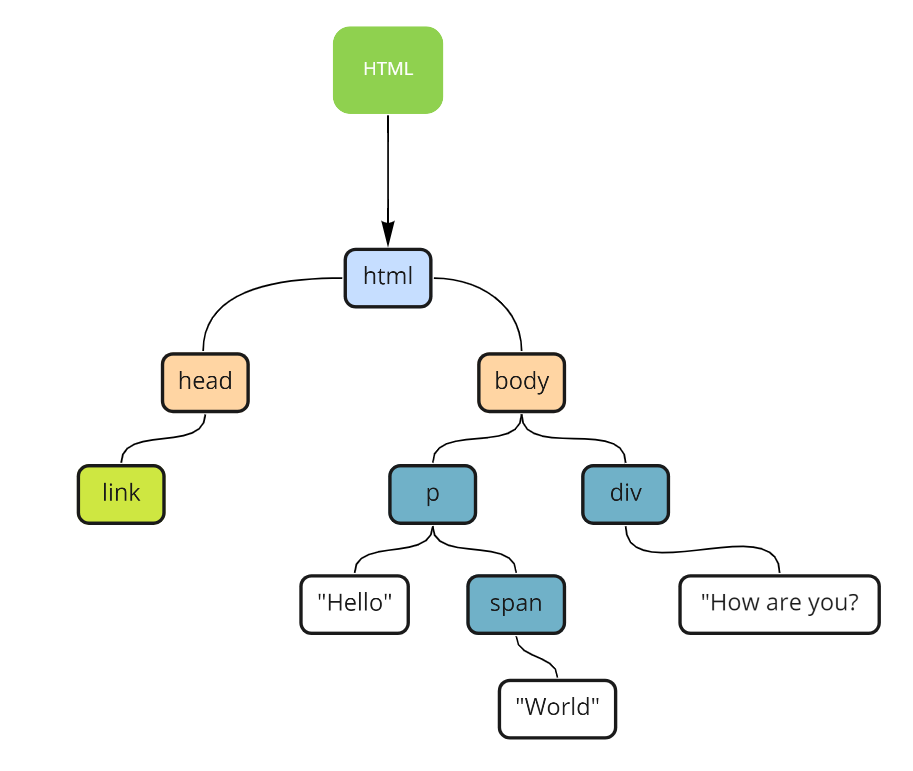
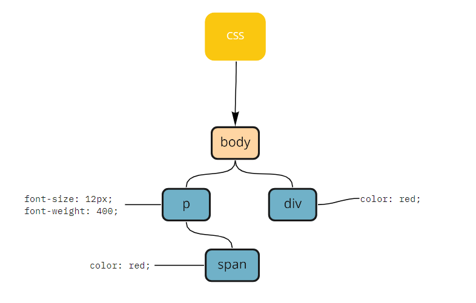
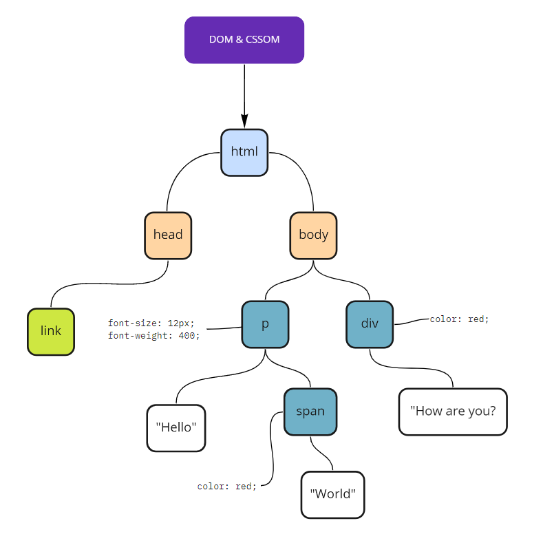

Thanks to the advancement of Web APIs today many websites are becoming more and more dynamic — parts of a web page can be disassembled and swapped with a relevant piece of content that aims to help the user achieve a specific goal.

But like every good thing, there's always a catch to it — It turns out there's a small price to pay every time a change is made to an element that can potentially shift the document however small it is.

Such a process is known as **Reflow**. It is important that we understand what a reflow is, why it happens and what preventive measures we can take to minimize the cost.

## What's a Reflow?
In short, Reflow is a user-blocking process in which a web browser recalculates the position and dimension of a UI element in order to ensure the element is rendered correctly.

To understand why reflow happens in the first place, we have to understand how the browser actually renders UI elements onto the screen.

## Critical Rendering Path

Web browser took a number of steps also known as CRP (Critical Rendering Path) in order to paint elements on your screen. Essentially there are four main steps: **Parsing, Render Tree, Layout, and Paint**.

Consider the HTML and CSS codes below

```html
<html>
  <head>
    <link rel="stylesheet" href="./styles.css">
  </head>
  <body>
    <p>
      Hello <span>World</span>
    </p>
    <div>How are you?</div>
  </body>
</html>

```

```css
p {
  font-size: 12px;
	font-weight: 400;
}

span {
  color: red;
}

div {
  color: red;
}
```

### Parsing

In this first step, HTML code was first parsed by the web browser in order to construct a DOM (Document Object Model) representing the nodes. If node contains a link to external resources, the parser will be halted until external resources are resolved.



When the parser encounters CSS codes, it will also construct CSSOM (CSS Object Model), a data structure containing information on how to style DOMs.



### Render Tree

With DOM and CSSOM ready, they will be combined into a document structure called **Render Tree**.

Render Tree only captures visible content. `<head>` sections and elements that have a `display: none;` attached to it (and its descendants) are not included in the Render Tree.  



### Layout

Before nodes can be painted, the web browser traverses through the Render Tree and performs a calculation in order to retrieve information such as the position, dimension, and relation of each element. This step is critical to ensure that elements are rendered correctly on the screen. The greater the number of nodes, the longer this step will take.

### Paint

Finally with everything in place, web browser can render each pixel onto the screen.

Notice that the *Layout* step is actually what we described as Reflow before, that's because they're essentially the same thing. This step is referred to as *Layout* during the initial CRP phase but is renamed as Reflow on subsequent calculation.

The same also applied to the *Paint* step. During the CRP phase, this step is referred to as *Repaint*.

## Many Reasons to Reflow

Reflow can happen for many reasons, but ultimately it comes down to both of these,

1. **If the mutation is made to the document that can potentially cause a layout shift.**  
This is fairly straightforward. Whenever an element changes its position or dimension, the web browser is required to recalculate its surrounding (including its ancestors) in order to paint correctly.
2. **If measurement happens after a mutation.**  
Web browser keeps a version of cache that contains intrinsic values of each node, a mutation made onto a DOM node will invalidate said cache thus requiring recalculation from the web browser.

Here's a non-exhaustive list of reasons why reflow happens and what can you do about it.

### DOM Manipulation

The most common cause of Reflow is probably this one. Action such as DOM insertion, deletion, or update changes the overall structure of the document hence recalculation is needed in order to reflect changes accurately onto the screen.

Consider an example of DOM insertion below

```html
<html>
  <head>
    <script type="text/javascript">
      function addElement() {
        const el = document.createElement('div');
        el.innerHTML = 'Appended!';
        const hello = document.querySelector('#hello');
        document.body.insertBefore(el, hello); // Insert before the div will cause layout shift
      }
    </script>
  </head>
  <body>
    <button onclick="addElement()">Add an element</button>
    <div id="hello">Hello World</div>
  </body>
</html>
```

Every time we click on a `Add an element` button, an element is appended to the document thus triggering a reflow.


As we've mentioned before, reflow is a costly operation because it is user-blocking.

One way to fix this is to batch changes together in a temporary document called **DocumentFragment** — A lightweight version of Document that stores DOM nodes just like a standard document. Since **DocumentFragment** is detached from the active document, any changes made onto it won't cause a reflow.

```html
<html>
  <body>
    <div id="hello">Hello World</div>
    <script type="text/javascript">
      setTimeout(function() {
        var fragment = new DocumentFragment();
        for (var i=0; i<20; i++) {
          const el = document.createElement('div');
          el.innerHTML = 'Appended!';
          fragment.appendChild(el);
        }
        document.body.prepend(fragment);
      }, 1000);
    </script>
  </body>
</html>
```

With this approach, only a single change is made directly to the active document therefore only a single reflow occurred.


### Style Change

Reflow can also happen when we change appearance of an element. In this example, we use Javascript to update the `height` of the `div` element. 

```html
<html>
  <body>
    <div id="box"></div>
    <div>Hello World</div>
    <script type="text/javascript">
      setTimeout(function() {
        const box = document.querySelector('#box');
        box.style.height = 100;
        box.style.marginTop = 50;
        box.style.left = 50;
      }, 500);
    </script>
  </body>
</html>
```

Since this script changes the dimensional and positional value of the element, it could mean multiple reflows.

Just like DOM manipulation, we can try to limit reflow by grouping together relevant changes in a single pass.

```html
<html>
  <body>
    <div id="box"></div>
    <div>Hello World</div>
    <script type="text/javascript">
      setTimeout(function() {
        const box = document.querySelector('#box');
        const newStyle = 'height: 100; margin-top: 50;';
        if(typeof(box.style.cssText) != 'undefined') {
          box.style.cssText = newStyle;
        } else {
          box.setAttribute('style', newStyle); // Fallback if `cssText` is not supported
        }
      }, 500);
    </script>
  </body>
</html>
```

### Measurement

It turns out certain web APIs that are used to retrieve the positions or dimensions of an element also trigger a reflow even though no apparent change is made to the element.

This is due to the fact that measurement values are cached and can be invalidated at a certain point of time and recalculation is often required in order to provide the correct values.

```html
<html>
  <body>
    <div id="box1">Box 1</div>
    <div id="box2">Box 2</div>
    <div id="box3">Box 3</div>
    <script type="text/javascript">
      setTimeout(function() {
        const height1 = document.querySelector('#box1').clientHeight;
      	document.querySelector('#box1').style.height = height1 + 10 + 'px';

        const height2 = document.querySelector('#box2').clientHeight;
        document.querySelector('#box2').style.height = height2 + 10 + 'px';

        const height3 = document.querySelector('#box3').clientHeight;
        document.querySelector('#box3').style.height = height3 + 10 + 'px';
      }, 500);
    </script>
  </body>
</html>
```

This code results in a multiple reflow because each modification likely invalidates caches.


We can optimize this code to have a single reflow

```html
<html>
  <body>
    <div id="box1">Box 1</div>
    <div id="box2">Box 2</div>
    <div id="box3">Box 3</div>
    <script type="text/javascript">
      setTimeout(function() {
        const height1 = document.querySelector('#box1').clientHeight;
        const height2 = document.querySelector('#box2').clientHeight;
        const height3 = document.querySelector('#box3').clientHeight;
	
        document.querySelector('#box1').style.height = height1 + 10 + 'px';
        document.querySelector('#box2').style.height = height2 + 10 + 'px';
        document.querySelector('#box3').style.height = height3 + 10 + 'px';
      }, 500);
    </script>
  </body>
</html>
```


### Image Load

Images take time to load, and only when the asset is loaded can we know the dimension of the image. This not only triggers a reflow but is also bad for user experience due to **layout shifts**.

The fix to this is straightforward, simply **add a fixed width and height** to the image element if the dimension is known ahead of time.

```html

```

This approach however won't work for responsive design, in this case use aspect ratio to maintain the dimension of the image.

```html
<html>
  <head>
    <style>
      .container {
        position: relative;
        overflow: hidden;
        padding-bottom: 56.25%;
      }
 
      .image {
        position: absolute;
        top: 0;
        left: 0;
        width: 100%;
        height: 100%;
      }
    </style>
  </head>
  <body>
    <div class="container">
      
    </div>
  </body>
</html>
```

### Window Resize

Although there is not much that can be done when it comes to reflow caused by window resize, it is advisable to minimize measurement by debouncing the event handler attached in the resize event.

### Hidden vs None

Whenever an element needs to be hidden but not necessarily removed from the DOM tree, we can use `visibility: hidden` instead of `display: none` since hidden element still takes up spaces, the browser only repaints the element (without reflow).

### Dealing with animations

CSS animation relies on changing the initial positional value of an element to a specific value, unavoidably resulting in a reflow. We can lessen the reflow impact by applying animation with `position: fixed or absolute` so it doesn't affect other elements.

## Conclusion

It is very less likely that we can avoid reflow entirely as it is a part of the process the web browser took to reflect changes accurately. Many web browsers today came up with solutions to deal with excessive reflow — Some are baked directly into the web browser workflows while others require manual intervention.

Hopefully, this post can provide a better understanding of how the browser works internally and how can you deal with excessive reflows through a number of best practices.
